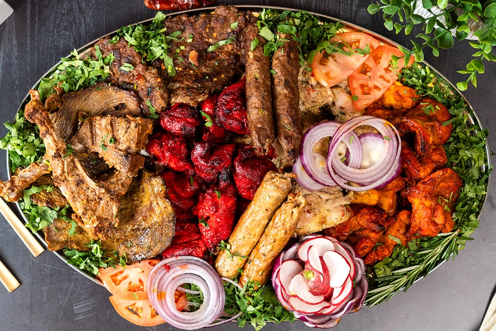

# Nutrients Tracker  

## Try yourself on Streamlit  
[Nutrients Tracker](https://nutrients-tracker.streamlit.app)

This Streamlit web app assists you in tracking your nutrient intake by leveraging Google's GenerativeAI service (Gemini Pro Vision) to analyze images and estimate calorie counts.

## 1. Features:

- **Image Upload:** Upload a photo of your food for analysis.
- **Text Prompt:** Provide additional context (optional).
- **Calorie Estimation:** Get an estimated breakdown of calories in the image.

## 2. Requirements:

- Python 3.x
- Streamlit (`pip install streamlit`)
- `dotenv` library (`pip install python-dotenv`)
- Google Cloud Project with GenerativeAI API enabled ([GenerativeAI](https://cloud.google.com/ai/generative-ai))

## 3. Setup:

1. Create a virtual environment (recommended): `python -m venv venv` or `conda create -p venv python==3.x -y`
2. Activate the environment: `source venv/bin/activate` (Windows: `venv\Scripts\activate`) or 'conda activate venv'
3. Install dependencies: `pip install streamlit python-dotenv`
4. Create a `.env` file in the project directory:
   - Add `GOOGLE_API_KEY=<YOUR_API_KEY>` (replace with your GenerativeAI API key)

## 4. Running the App:

1. Open a terminal in the project directory.
2. Run the app: `streamlit run app.py`
3. Access the app in your web browser at http://localhost:8501.

## 5. Usage:

1. Upload an image of your food.
2. (Optional) Provide a text prompt for additional information.
3. Click the "Tell me the total calories" button.

## 6. Output:

The app will display the estimated calorie breakdown from the image analysis using Google GenerativeAI.

1. The user uploads the picture of his food and ask a question, "Is this food healthy?":  

    
 
  

2. When the prompt is passed, the system replies:  
   
    

**Why not try with your food?**

## 7. Note:

This is a basic example using a free-tier API. Calorie estimates may not be perfectly accurate. Consider using a reliable nutrition database for detailed information.

## 8. Additional Considerations:

- You can explore advanced Streamlit features for layout customization and interactivity.
- Integrate error handling and user feedback mechanisms for a more robust experience.
- Be mindful of API usage limits and potential costs when employing cloud services.

## 9. Disclaimer:

This application and its output are for informational purposes only and should not be taken as medical advice. Always consult a licensed healthcare professional for personalized guidance on nutrition and calorie intake.

