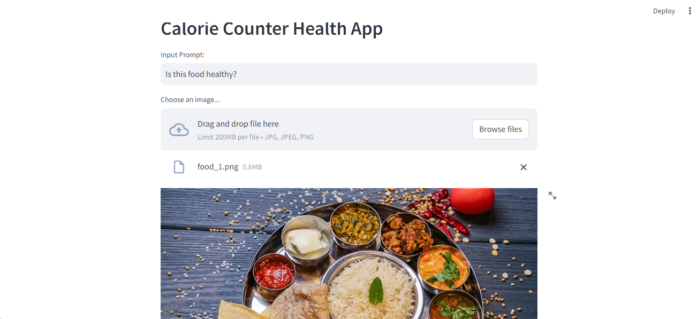
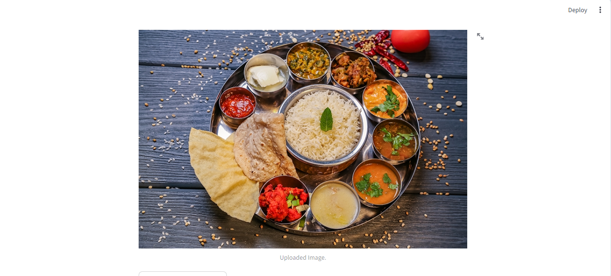
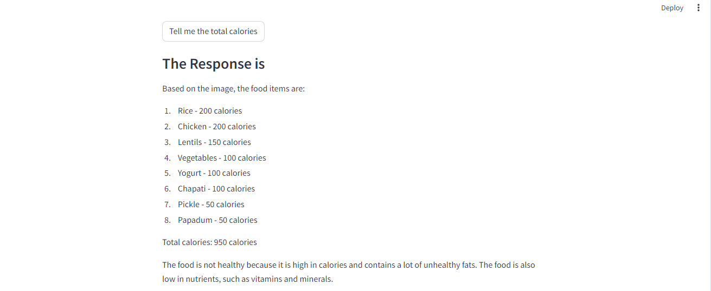

# Nutrients Tracker    

 

The app counts the calories from the image of a plate/dish. It also advises a person on his/her calorie intake.   

It is a streamlit web app that uses Google's open-source Large Image Model gemini pro (vision LLM).  

When a user uploads the picture of his food, it extracts the information and displays the calorie of each food item. The user may ask a question about his food. 

## Working  
The working of Food Calorie counter and adviser is shown in the Screen captures below:  

1. The user uploads the picture of his food and ask a question, "Is this food healthy?":  

    
 
  

2. When the prompt is passed, the system replies:  
   
    

**Why not try with your food?**
